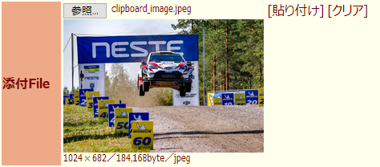
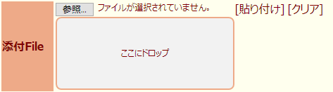
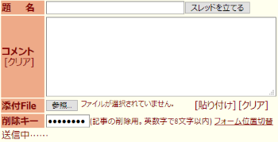
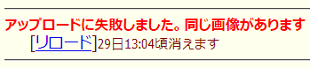

##  KOSHIAN 返信フォーム拡張 改
このFirefoxアドオンはふたば☆ちゃんねるで返信後のページリロードを抑制する[Pachira](https://addons.mozilla.org/ja/firefox/user/anonymous-a0bba9187b568f98732d22d51c5955a6/)氏の[KOSHIAN 返信フォーム拡張](https://addons.mozilla.org/ja/firefox/addon/koshian-返信フォーム拡張/)の非公式改変版です。  
クリップボード内の画像ファイルを貼り付ける機能や添付ファイルのプレビュー機能などをオリジナル版に追加しています。  

※このアドオンはWebExtensionアドオン対応のFirefox専用となります。  
※他のKOSHIAN改変版などのふたば閲覧支援ツールは[こちら](https://github.com/akoya-tomo/futaba_auto_reloader_K/wiki/)。  

## 機能
* オリジナルの機能（KOSHIAN 返信フォーム拡張）
  - ふたば☆ちゃんねるのレス送信モードで返信した後ページをリロードしないようにします
* 追加・修正された機能（KOSHIAN 返信フォーム拡張 改）
  - 添付ファイルの入力機能を拡張する機能を追加（デフォルト：無効）  
    添付ファイルの入力機能を拡張して以下の機能を追加します。  
    - 添付ファイルの\[貼り付け\]ボタンと\[クリア\]ボタンを追加  
      \[貼り付け\]ボタンでクリップボード内の画像ファイルを添付ファイルに貼り付けできます。  
      \[クリア\]ボタンで添付ファイルをクリアできます。  
      クリップボード内のファイルが画像以外のときはファイルダイアログを開くこともできます。（デフォルト：無効）  
    - 添付ファイルのプレビュー機能を追加（デフォルト：250px）  
      添付ファイルをプレビュー表示します。（プレビュー最大サイズ：250px × 250px）  
        
      プレビューの下に添付ファイルの縦横サイズ・ファイルサイズ・ファイルタイプも表示します。  
       ファイルサイズが制限サイズより大きいときは黄色で警告します。  
      動画ファイルは自動再生やループ再生をすることができます。  
    - 添付ファイルのドロップエリアを追加（デフォルト：0px = 無効）  
      ファイル入力欄の下にファイルをドロップできるエリアを設定できます。  
        
    -  ファイルサイズが制限よりも大きいPNG・JPEGファイルを自動的に縮小する機能（デフォルト：無効）  
      ファイルサイズが制限より大きいときは自動でJPEGに変換され、制限以下になるように画質・縦横サイズが調整されます。  
      PNG・JPEG以外の画像ファイルや動画ファイルは変換されません。  
  - スレ立てのフォームに対応  
    スレ立てのフォームに対応しました。  
    立てたスレを新しいタブに開くことができます。（デフォルト：無効）  
    新しいタブを開くときにポップアップブロックが表示されたときは許可してください。  
      
  - コメントの\[クリア\]ボタンとメール欄の\[sage\]ボタンを追加（デフォルト：有効）  
    コメントをクリアしたり、メール欄のsageを切り替えすることができます。  
  - 返信時に状況やエラーメッセージを表示  
    返信時に「返信中」や「スレ更新中」などの状態やサーバーからのエラーメッセージを表示します。  
      
  -  返信後に手書きjsのキャンバスを消去する機能（デフォルト：無効）  
  返信後に手書きjsのキャンバスを消去します。但し、返信直前のキャンバスの状態にアンドゥで戻すことができなくなります。  
  - 返信後に添付ファイルをクリアするように修正  
  返信後に添付ファイルが残ったままになる不具合を修正しました。  
  （[futaba form image previewer](https://greasyfork.org/ja/scripts/36659-futaba-form-image-previewer/)にも対応しています）  

## インストール
### **● 最新バージョン**(v1.4.3)
**GitHub**  
  
※このアドオンはオリジナル版同様に実験的アドオンになります。最新バージョンで不具合が発生する場合は[Releasesページ](https://github.com/akoya-tomo/koshian_form_futaba_kai/releases)から古いバージョンのxpiファイルをインストールしてみてください。  
※v1.3.0から「すべてのウェブサイトの保存されたデータへのアクセス」の権限が追加で要求されます。  
　（Web上の画像から添付ファイルへの貼り付けに使用）  
※v1.0.0から「クリップボードからのデータ取得」の権限が追加で要求されます。  

※「接続エラーのため、アドオンをダウンロードできませんでした。」と表示されてインストール出来ない時はインストールボタンを右クリックしてxpiファイルをダウンロードし、メニューのツール→アドオン（またはCtrl+Shift+A）で表示されたアドオンマネージャーのページにxpiファイルをドラッグ＆ドロップして下さい。  

## 追加機能の補足  
* 「添付ファイル入力機能を拡張する」を有効にする前に、必ず**futaba form image previewerを無効**にして、開いているレス送信モードのページを更新してください。両方有効だと正常に動作しません。  
  「添付ファイル入力機能を拡張する」が無効ならfutaba form image previewerが有効でも正常に動作します。  
* 「添付ファイル入力機能を拡張する」の有効・無効を切り替えたときは開いているレス送信モードのページを更新してください。  
* プレビューの上にドロップするとドロップしたファイルが新しい添付ファイルとなります。（ドロップエリアと同じ扱い）  
* 動画プレビューは手動で再生を制御することはできません。また無音での再生となります。  
* [futaba auto reloader K](https://greasyfork.org/ja/scripts/36235-futaba-auto-reloader-k/)使用時はどちらかのコメントの\[クリア\]ボタンを無効にしてください。  
*  \[sage\]ボタンを有効にしたときにfutaba auto reloader Kの操作ボタンが折り返されるのを避けたい場合は[KOSHIAN 返信フォームを固定 改](https://github.com/akoya-tomo/koshian_float_form_kai/)で返信フォームの幅を増やしてください。  
* 「画像ファイル以外のときはファイルダイアログを開く」オプションはWindowsで以下の操作を想定しています。  
  \[貼り付け\]ボタンを押す →  
  - 画像ファイル → そのまま添付される  
  - 動画ファイル → ファイルダイアログが開く → 「Ctrl + V」で貼り付けして「開く」 → 添付される  
*  異なるブラウザでコピーした画像は貼り付けできないことがあります。  
*  「画像だけを表示」したページで画像をドラッグ選択してコピーすると貼り付けできません。「全て選択」してコピーするか、コンテキストメニューから「画像をコピー」を選択して貼り付けしてください。  
*  サイズ変更された画像はファイル名が「resized_(元のファイル名 or image).jpeg」になります。  

## 注意事項
* 本アドオンを有効にしたときはオリジナル版を無効にするか削除して下さい。  
* オリジナル版とは別アドオンなので設定は初期値に戻ります。  
  再度設定をお願い致します。  
* フレーム表示では動作しません。  
* Web上の画像から添付ファイルへの貼り付けは実験的な機能になります。  
  貼り付けできないサイトや画像があればご連絡ください。  

## ライセンス
* このアドオンは文字コード変換に[encoding.js](https://github.com/polygonplanet/encoding.js)を使用しています。  

## 更新履歴
* v1.4.3 2019-05-29
  - v1.4.1以降でWeb上の画像の貼付またはリサイズした添付ファイルが空で送信される不具合を修正
* v1.4.2 2019-05-28
  - 貼付動作のメッセージ表示の不具合を修正
  - 画像と動画以外のファイルを添付したときはプレビューをクリアするように修正
* v1.4.1 2019-05-27
  - 添付ファイルの貼付動作でエラーが発生したときにメッセージを表示するように修正
* v1.4.0 2019-05-26
  - ファイルサイズが制限よりも大きいPNG・JPEGファイルを自動的に縮小する機能を追加
  - 返信後に手書きjsのキャンバスを消去する機能を追加
  - 返信後に手書きから文字入力に戻るように修正
  - スレ立てのフォームのパラメータに非ASCII文字が含まれたときの処理を追加
* v1.3.0 2019-05-22
  - Web上の画像から添付ファイルへの貼り付けを実験的機能として追加
* v1.2.3 2018-12-22
  - 返信フォームのパラメータに非ASCII文字が含まれたときの処理を追加
* v1.2.2 2018-12-20
  - 返信フォームの仕様変更による送信動作の不具合を修正
* v1.2.1 2018-12-20
  - 返信フォームの仕様変更による文字化けを修正
* v1.2.0 2018-08-21
  - スレ立てのフォームのメッセージ表示方法変更
  - ドロップエリアを無効にしても枠が残る不具合を修正
* v1.1.0 2018-08-14
  - スレ立てのフォームに対応
* v1.0.1 2018-08-06
  - 「添付ファイル入力機能を拡張する」が無効でもfutaba form image previewerが動作しないことがある不具合を修正
* v1.0.0 2018-08-05
  - 添付ファイルの貼り付けボタンとクリアボタンを追加
  - 添付ファイルのプレビュー機能を追加
  - 添付ファイルのドロップエリアを追加
  - コメントのクリアボタンとメール欄のsageボタンを追加
* v0.2.1 2018-07-31
  - エラーメッセージを表示した後に通常メッセージが赤字・太字で表示されてしまう不具合を修正
  - エラーメッセージを修正
* v0.2.0 2018-07-28
  - 返信時に状況やエラーメッセージを表示する機能を追加
* v0.1.0 2018-03-24
  - KOSHIAN 返信フォーム拡張 v0.1.1ベース
  - 返信時に添付ファイルをクリアする機能を追加
